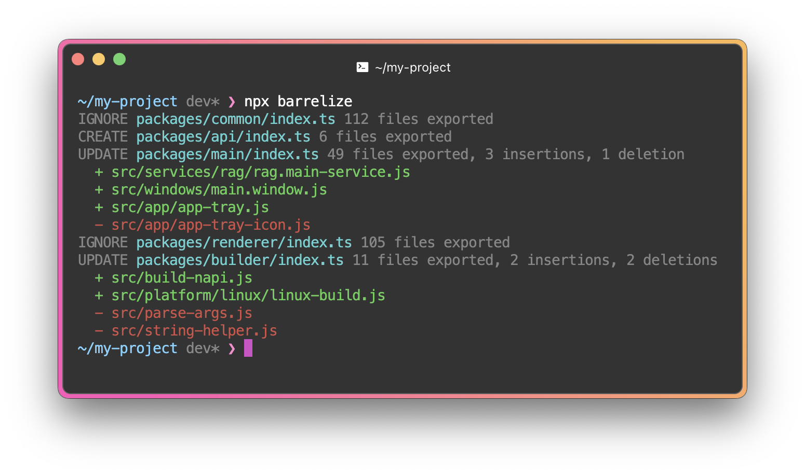

# Barrelize

🚀 A modern, lightweight and efficient tool for automatically generating index (barrel) files in your JavaScript and TypeScript projects.

Barrelize simplifies module exports by creating clean, centralized `index.js` or `index.ts` files, reducing boilerplate and improving project organization.

[](https://www.npmjs.com/package/barrelize)
[](https://opensource.org/licenses/MIT)



## Features

- **Automatic Barrel Generation**: Scans directories and creates index files with exports for all modules.
- **TypeScript Support**: Seamlessly works with TypeScript projects, preserving type safety.
- **Customizable**: Configure file patterns, ignore specific files, or customize export styles (named, default, or both).
- **Recursive**: Optionally generate barrels for nested directories.
- **CLI & API**: Use via command line for quick setups or integrate programmatically in your build scripts.
- **Smart Export Control**: Fine-grained control over what gets exported and how:
  - Export specific members, namespaces, or use regex patterns
  - Support for custom export names and transformations
  - Support for asterisk (\*) exports
  - Flexible export path manipulation
- **Flexible Path Handling**: Replace patterns in export paths using string or regular expressions
- **Customizable Formatting**: Control bracket spacing, quotes, semicolons, and newlines

### Why Use Barrelize?

- **Save Time**: Eliminate manual creation and maintenance of barrel files.
- **Cleaner Imports**: Simplify import statements with a single entry point for each directory.
- **Scalable**: Ideal for large projects with complex folder structures.

## Installation

```bash
npm install --save-dev barrelize
```

## Quick Start

1. Initialize configuration (optional):

```bash
npx barrelize init
```

2. Generate barrel files:

```bash
npx barrelize
```

## CLI Commands

### `barrelize init [config path]`

Creates a `.barrelize` configuration file in your project.

```bash
npx barrelize init                # Creates .barrelize in current directory
npx barrelize init barrelize.json # Creates config at specified path
```

### `barrelize [config path]`

Generates barrel (index) files based on your configuration. The tool will:

- Create or update index files in specified directories
- Export all matching files based on include/exclude patterns
- Order exports according to your configuration
- Apply path replacements
- Format exports according to your style preferences

```bash
npx barrelize                # Uses default .barrelize config
npx barrelize custom.json    # Uses specified config file
npx barrelize --watch        # Generate and watch for changes
```

Options:

- `-w, --watch`: Watch for changes and regenerate barrel files automatically

## Configuration

Create a `.barrelize` file in your project root. The configuration file uses JSON5 format, which supports comments and is more flexible than standard JSON:

```jsonc
{
  "$schema": "node_modules/barrelize/schema.json",
  // Global formatting settings
  "bracketSpacing": true, // Add spaces between brackets in exports (default: true)
  "singleQuote": true, // Use single quotes for exports (default: true)
  "semi": true, // Add semicolons after exports (default: true)
  "insertFinalNewline": true, // Add newline at end of file (default: true)

  // Configure multiple barrels
  "barrels": [
    {
      // Root directory to start from (default: "")
      "root": "src",
      // Name of the index file (default: "index.ts")
      "name": "index.ts",
      // Files to include in the barrel (default: ["**/*.ts"])
      "include": ["**/*.ts"],
      // Files to exclude from the barrel (default: [])
      "exclude": ["**/*.test.ts"],
      // Optional ordering of exports (default: [])
      "order": ["types", "constants", "utils"],
      // String/regex patterns to find and replace in export paths
      "replace": {
        "/\\.ts$/": "" // Remove .ts extension from paths
      },
      // Export configuration for different file patterns
      "exports": {
        // Glob pattern exports file with string or regular expression patterns
        "**/*.ts": [
          "* as lib", // Export all as namespace
          "/(.+)Config$/ as $1LibConfig", // Rename exports matching pattern
          "util" // Export specific member
        ]
      },
      // Override global formatting settings per barrel
      "bracketSpacing": true,
      "singleQuote": true,
      "semi": true,
      "insertFinalNewline": true
    }
  ]
}
```

### Using Export Variables

You can use variables in export aliases to dynamically name exports based on file names or export names:

```jsonc
{
  "barrels": [
    {
      "root": "src",
      "name": "index.ts",
      "include": ["components/**/*.tsx"],
      "exports": {
        "components/**/*.tsx": [
          "default as @fileName" // Use file name
        ]
      }
    }
  ]
}
```

**Supported Variables:**

- `@fileName` - The file name without extension (e.g., "Button" from "Button.tsx")
- `@exportName` - The export name of the default export from the code

**Examples:**

```typescript
// components/button.tsx
export default function ButtonComponent() {...}
```

Using `"default as @fileName"`:

```typescript
export {default as button} from './components/button';
```

Using `"default as @exportName"`:

```typescript
export {default as ButtonComponent} from './components/button';
```

Using both in one pattern `"default as @fileName@exportName"`:

```typescript
export {default as buttonButtonComponent} from './components/button';
```

**Notes:**

- Works with nested directory paths (e.g., `utils/parsers/json.ts` → fileName is `json`)
- Preserves dots in file names (e.g., `my.component.tsx` → `my.component`)
- `@exportName` works with function, class, and variable default exports
- For anonymous default exports (arrow functions without a name), `@exportName` falls back to the member name ("default")
- Variables can be combined and used multiple times in the same alias
- Works alongside other export patterns and with the `replace` config option

## Example

Before:

```
src/
  ├── types.ts
  ├── constants.ts
  ├── utils.ts
  └── components/
      ├── Button.tsx
      └── Input.tsx
```

After running `barrelize`:

```
src/
  ├── types.ts
  ├── constants.ts
  ├── utils.ts
  ├── index.ts           # New!
  └── components/
      ├── Button.tsx
      └── Input.tsx
```

Generated `src/index.ts`:

```typescript
export * from './types';
export * from './constants';
export * from './utils';
export * from './components/Button.tsx';
export * from './components/Input.tsx';
```

## Contributing

Contributions are welcome! Please feel free to submit a Pull Request.

## License

MIT © Nizami
